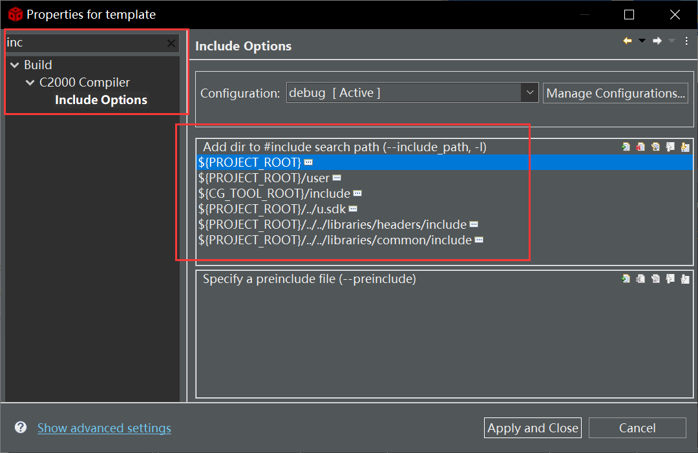
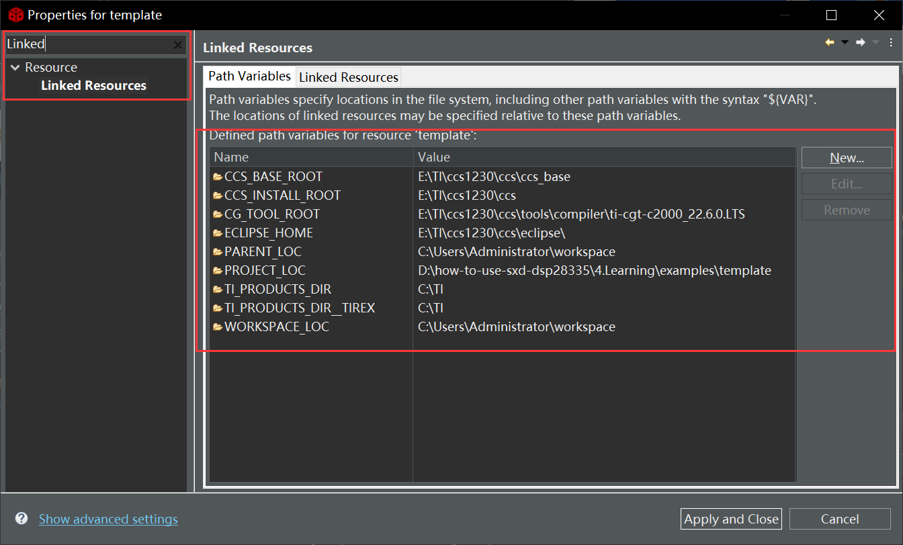
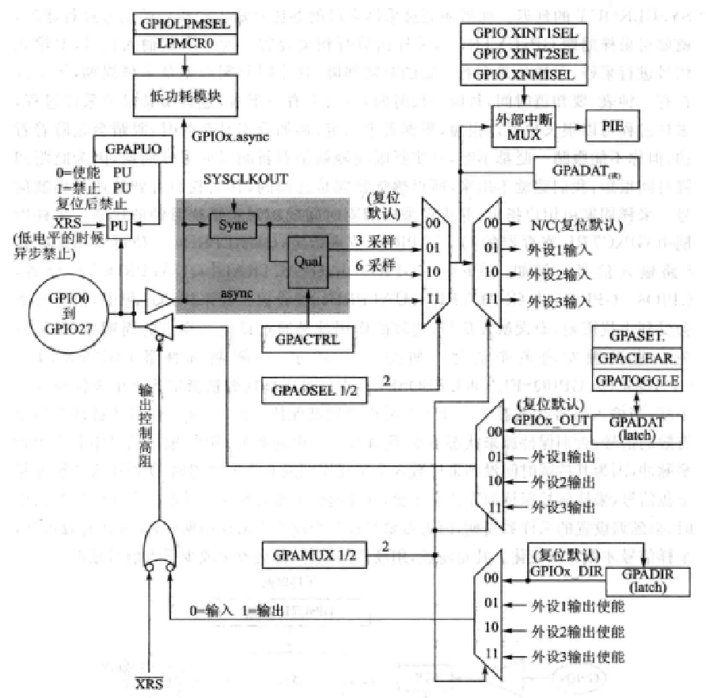

```c
<name>template</name>
```


添加头文件路径 Right click Project Name - Properties - Include option



注：必须右键项目名添加

若通过右键文件夹，可能会导致编译失败。此时[解决方法]( https://blog.csdn.net/qq_34621711/article/details/108517857)是：

右击图标上有小扳手的文件夹 - resource - configuration - Reset to Default...


添加源文件路径 New - Folder - Advanced


添加路径变量




```
EINT ：允许中断。
DINT：禁止中断。
ERTM：允许调试模式。
DRTM：禁止调试模式。
EALLOW ：允许写保护区域的写操作。
EDIS：禁止写保护区域的写操作。
ESTOP0：停机指令，等待外部复位信号或者电源重启。
```


GPIO




QUAL：如按键消抖用


Peripheral -> PIE -> CPU