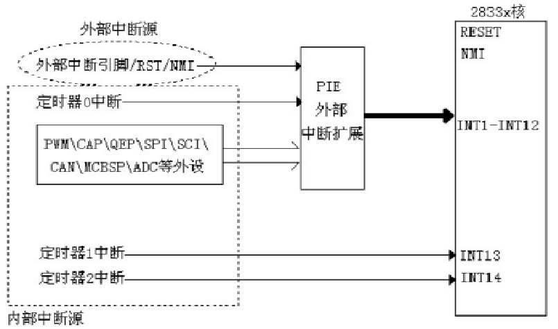
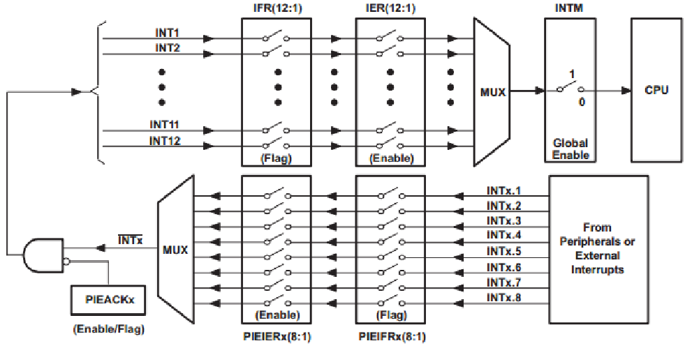
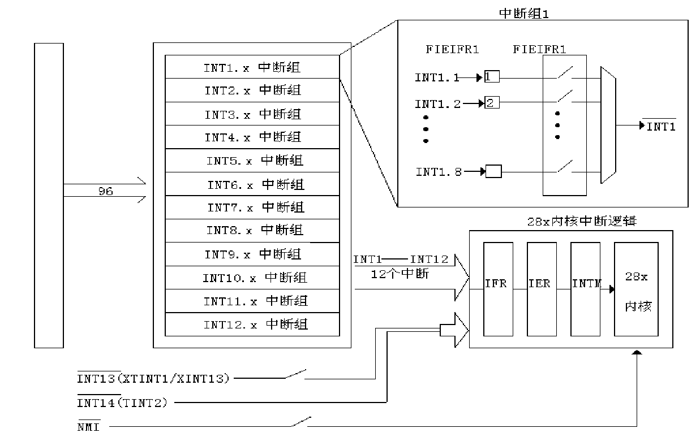
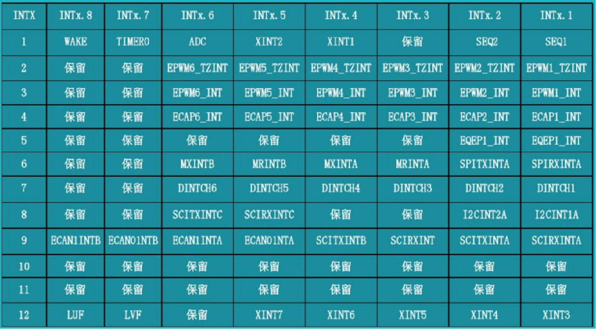
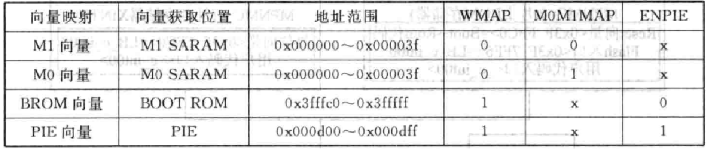
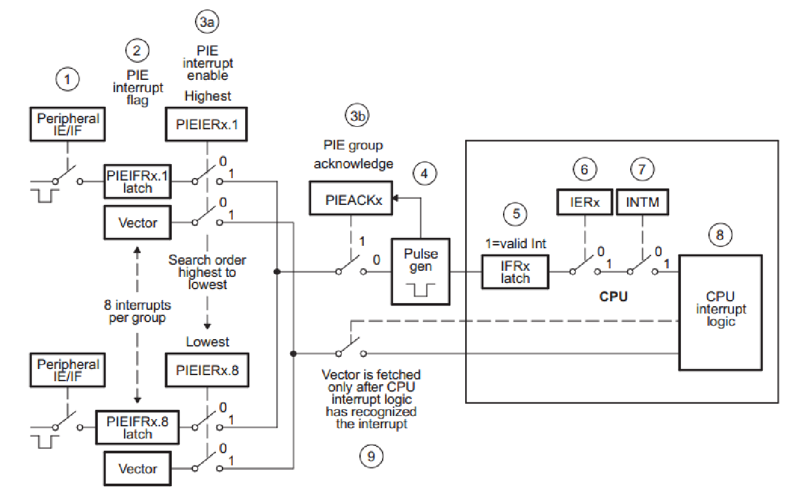
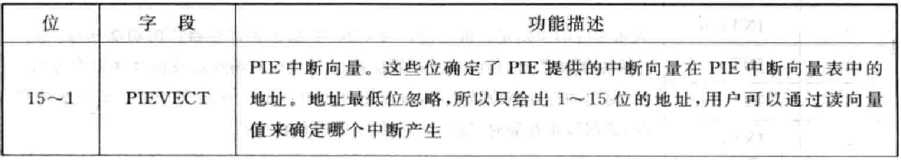
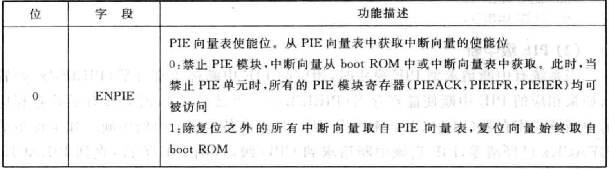
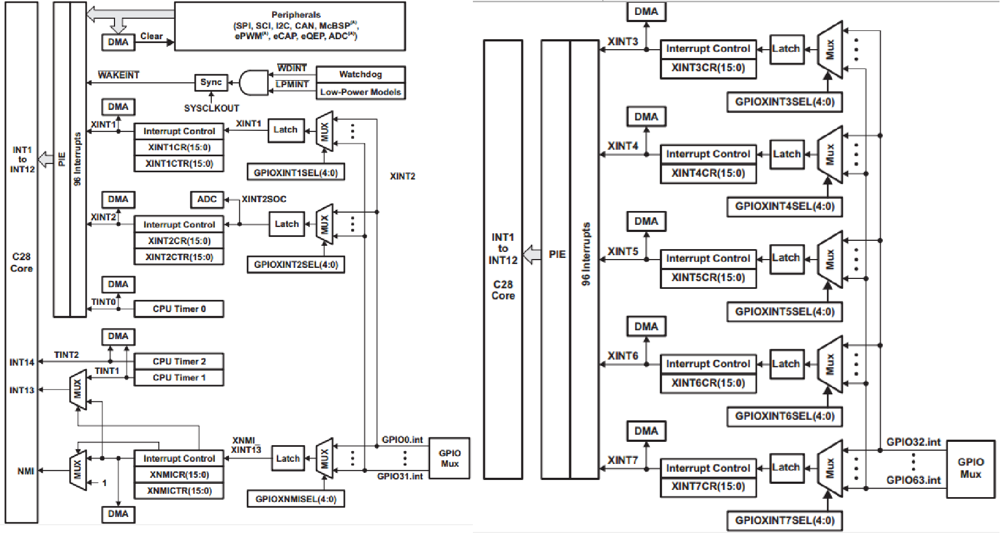
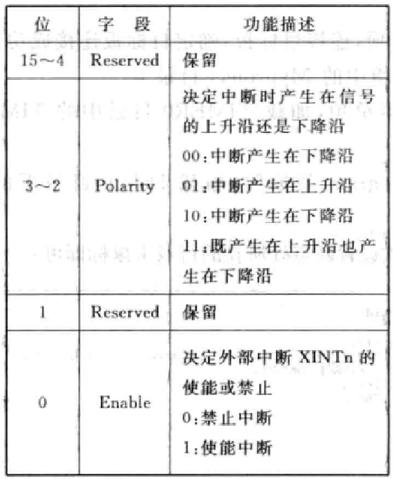

gmake -k -j 12 all -O

# 中断

三级中断机制：外设级中断 $\rightarrow$ PIE 级中断（中间层）$\rightarrow$ CPU 级中断（内核层）

（CPU级）16个中断线：2个不可屏蔽中断（RESET和NMI）+ 14个可屏蔽中断。

（PIE级）中断线复用层：CPU 中断线数量有限，而外设中断源很多，就需要复用管理的中间层 PIE。

中断响应：外设中断允许 $\rightarrow$ PIE 允许 $\rightarrow$ CPU做出响应。 

PIE 分为 12 组，对应 CPU 的 12个可屏蔽中断线。

在外部中断触发后，需在中断服务函数中将 PIEACKx 对应中断线允许位置 1，以允许触发 CPU 中断（触发后 PIEACKx 对应位会自动清除）。

共 12 组，每组 8 个外设中断：

中断向量：中断服务程序入口地址

该中断向量用2个16位寄存器存放。入口地址是22位的，地址的低16位保存在该向量的低16位；地址的高16位则保存在它的高6位，更高的10位保留。 

映射方式：

中断向量表可以被映射到4个不同的存储区域，在实际应用中，F28335只能使用PIE中断向量表映射区域。中断向量表映射主要由以下型号控制。
①VMAP：该位在状态寄存器1（ST1）的第3位，复位后值为1。可以通过改变ST1值或使用SETC/CLRC VMAP指令改变VMAP的值，正常操作时该位置1。
②MOM1MAP：该位在状态寄存器1（ST1）的第11位，复位后该位置1.可以通过改变ST1的值或使用SETC/CLRC M0M1MAP指令改变M0M1MAP的值，正常操作该位置1。M0M1MAP=0是厂家测试时使用。
③ENPIE：该位在PIECTRL寄存器的第0位，复位的默认值为0（PIE被屏蔽）。器件复位后，可以通过调整PIECTRL寄存器的值进行修改。
根据上述控制位的不同设置，中断向量表有不同的映射方式，如图 

#### 中断操作

* 复位中断操作过程

  PIE模块8个中断分成一组与外部中断一起共用一个CPU中断，总共有12组中断（INT1-INT12）。每组中断有相应的中断标志（PIEIFR）和使能寄存器（PIEIER），这些寄存器控制PIE向CPU申请中断。同时CPU还根据PIEIFR和PIEIER寄存器确定执行哪个中断服务程序。在清除PIEIFR和PIEIER的位时，要遵循以下3个规则。
  ①不要用软件编程清除PIEIFR的位
  ②软件设置中断优先级
  ③使用PIEIER禁止中断

* 使能/禁止复用外设中断的处理

  应用外设中断的使能/禁止标志位使能/禁止外设中断，PIEIER和CPU IER寄存器主要是在同一组中断内设置中断优先级。如果要修改PIEIER寄存器的设置，有两种方法。第一种方法是保护相应的PIE标志寄存器标志位，防止中断丢失。第二种方法是清除相应的PIE寄存器的标志位。

* 外设复用中断向CPU申请中断的流程

#### 中断相关寄存器

* PIE控制寄存器（PIECTRL）

#### GPIO 中断

共7个外部中断XINT1-XINT7，其中XINT1-XINT2只能对GPIO0-GPIO31配置；XINT3-XINT7只对GPIO32-GPIO63配置。XINT13还有一个不可屏蔽的外部中断XNMI共用中断源。每一个外部中断可以被选择为正边沿或负边沿触发，也可以被使能或者禁止（包括XNMI）。可屏蔽中断单元包括一个16位增计数器，该计数器在检测到有效中断边沿时复位为0，同时用来准确记录中断发生的时间。 

外部中断控制寄存器（XINTnCR）

