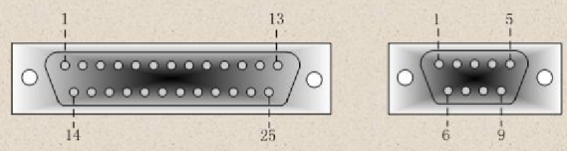
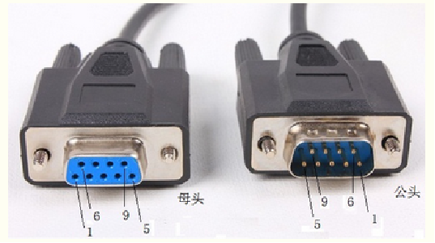
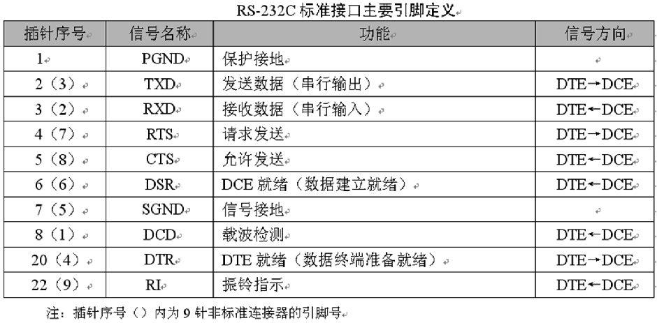
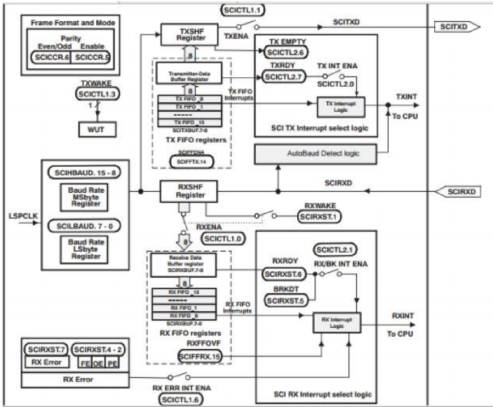
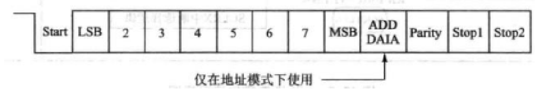
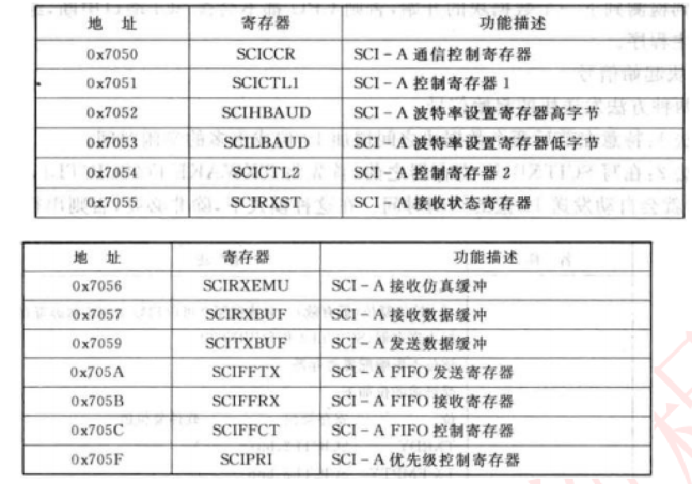

gmake -k -j 12 all -O

# SCI

## RS232

S-232C对逻辑电平也做了规定，如下
在TXD和RXD数据线上：
1.逻辑1为-3~-15V的电压
2.逻辑0为3~15V的电压
在RTS、CTS、DSR、DTR和DCD等控制线上：
1.信号有效（ON状态）为3~15V的电压
2.信号无效（OFF状态）为-3~-15V的电压   
	由此可见，RS-232C是用正负电压来表示逻辑状态，与晶体管-
晶体管逻辑集成电路（TTL）以高低电平表示逻辑状态的规定正好
相反。

#### SCI

SCI（Serial Communication Interface）串行通信接口

接收和发送有各自独立的信号线，但不是同一个时钟（异步通信）。

TTL 电平的 1 和 0 的特征电压分别是 2.4V 和 0.4V。

支持通信速率自动检测和 16 级的收发  FIFO 缓冲等，

（1）SCI 数据格式
SCI 的发送和接收都采用不归零码格式，具体包括：
①1 位起始位
②1~8 位数据。
③1 个奇偶校验位（可选择）。
④1 位或 2 位停止位。
⑤区分数据和地址的附加位（仅在地址位模式存在）

数据的基本单元称为字符，它有 1~8 位长。每个字符包括 1 位启
动位、1 或2 位停止位、可选择的奇偶校验位和地址位。在 SCI 
通信中，带有格式信息的数字字符称为帧，如下图所示：

SCI 相关寄存器

