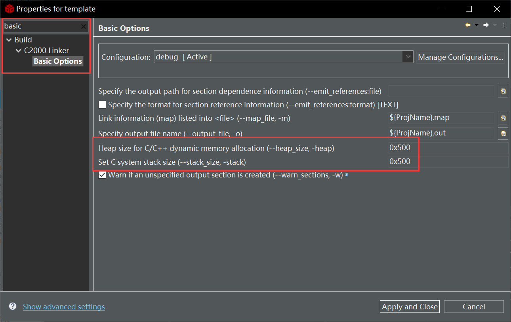
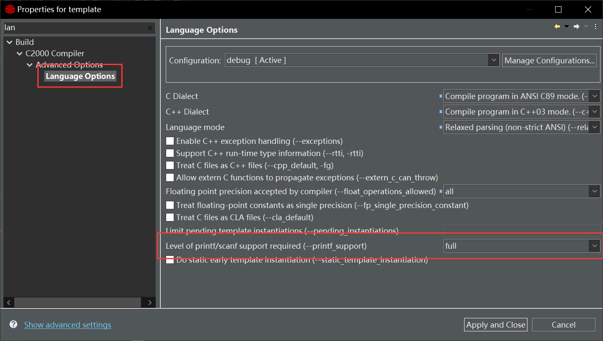
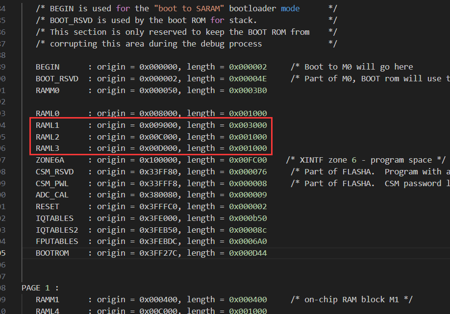
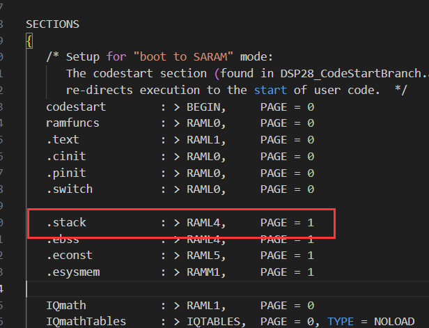
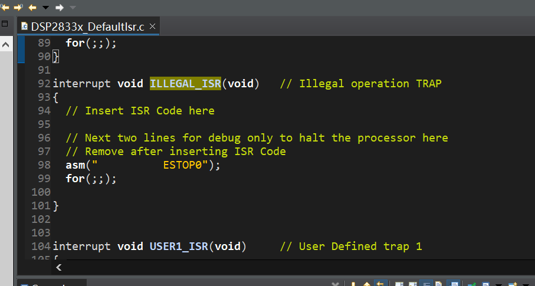
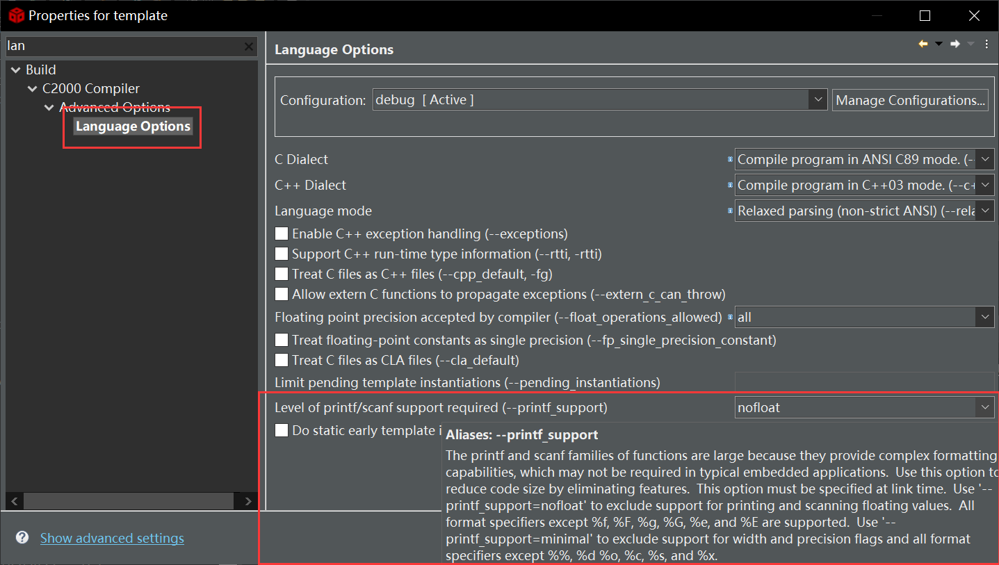
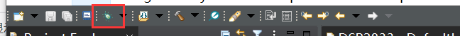
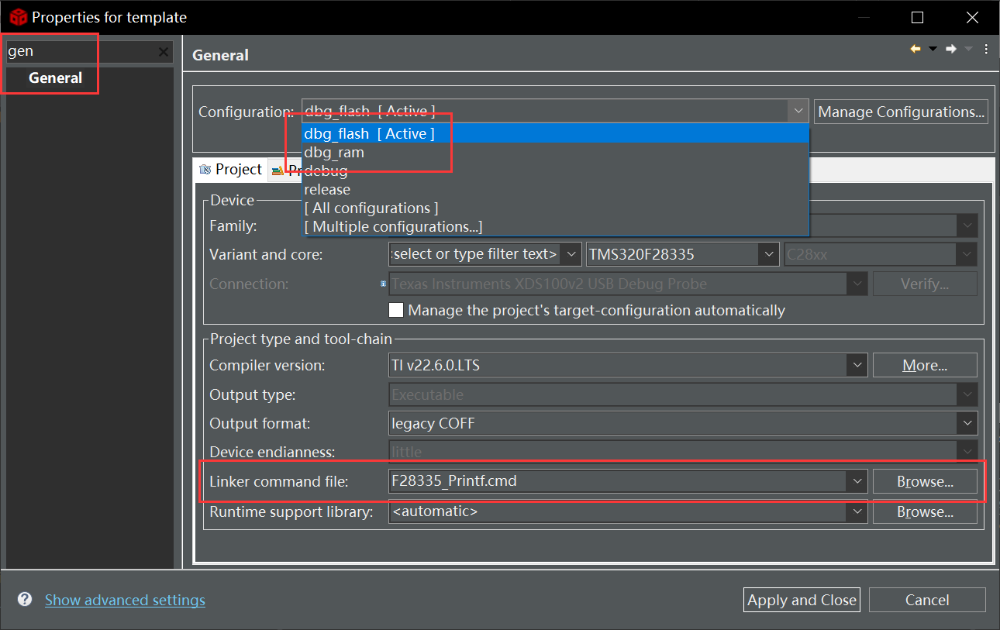
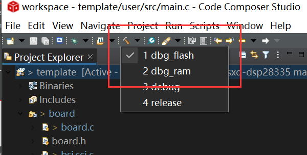
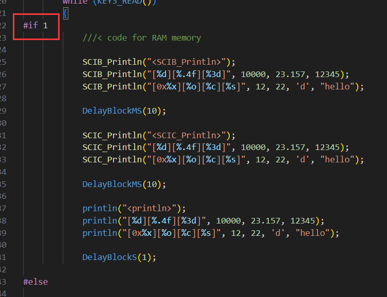

gmake -k -j 12 all -O

# SCI

## 28335_RAM_lnk.cmd

* 增大堆栈

使用 SCIx_Printf 是会分配大段堆空间，若输出有乱码，可能是堆过小导致。

* 启用浮点支持

* 内存分配

stdio.h 这个库占的体积蛮大的，需增大 RAM，编译才能通过。

注：改了某行长度（length），就得改下行的起始地址（origin）

程序段也需进行更改：

## F28335.cmd

注：若使用了 %f 等浮点格式化，导致 进入 `ILLEGAL_ISR` 中断，程序无法继续允许。

可关闭浮点支持，即修改为 `nofloat`。

怎么发现的？调试模式。

#### CIO...

# Demo

配置 CMD

切换编译用的 CMD：

切换代码段（需配合对应的 CMD）：

