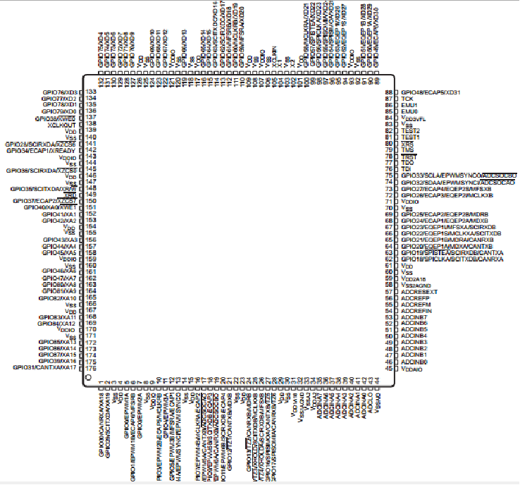
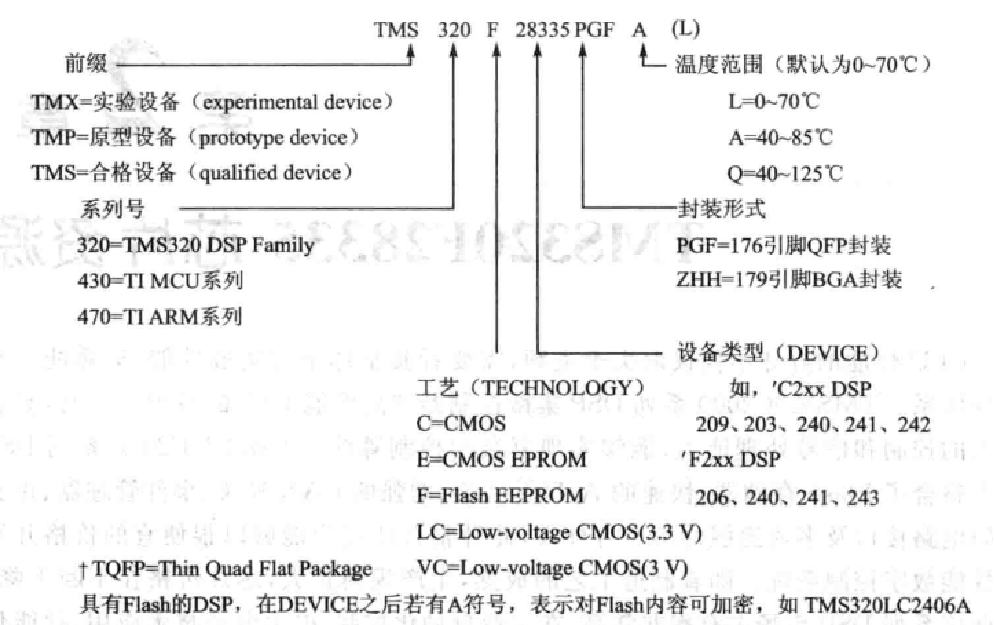
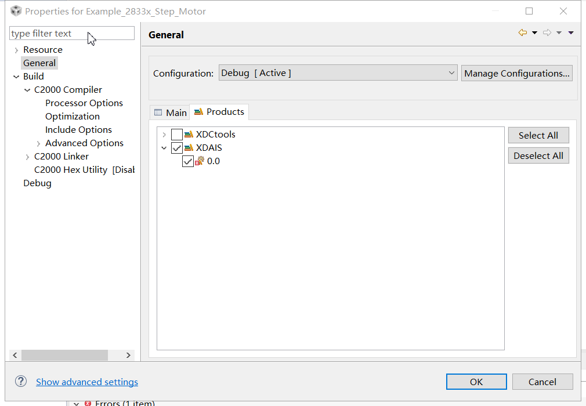
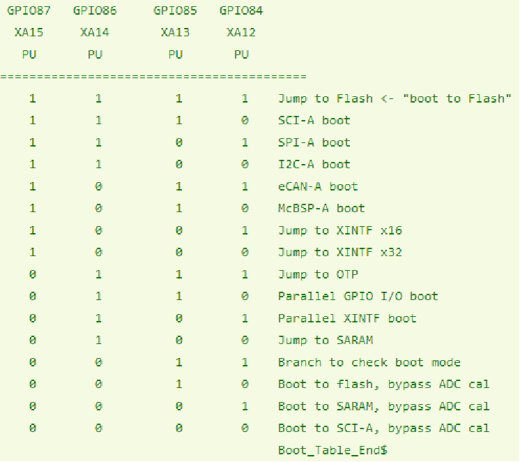

特点：

①

单周期内完成 1个 32x32 位乘法累加运算，或 2个 16x16 位乘法累加运算。

（普通32位单片机至少需要4个周期）

②快速的中断响应

③可在任何内存位置进行单周期读、修改、写操作


放 E 盘，不能出现中文及特殊符号


#### 芯片被锁？

烧录过程中断电、按复位按键、拔掉仿真器，若此时在烧录密钥可能造成芯片锁死。

在 debug 界面，点击菜单 Tools -> On chip flash，点击安全选项 Code Security Password 栏目中的 Unlock 进行解锁（默认 0xFFFF 代表没加密）。`全0代表锁死不能解密`了，也就是不能烧录到 flash 里，只能 ram 调试了。

密码区 0x33FFF8 - 0x33FFFF 全为 0xFFFF，则不会激活代码保护模块，相当于没有密码。


https://blog.csdn.net/kunkliu/article/details/116598904

1.加密2种途径：
1) 密码伴随.out文件烧入；

 a  文件DSP2833x_CSMPasswords.asm中添加以下代码

   .sect "csmpasswds"
   .int 0xFFFF;PWL0 (LSW of 128-bit password)
   .int 0xFFFF;PWL1
   .int 0xFFFF;PWL2
   .int 0xFFFF;PWL3
   .int 0xFFFF;PWL4
   .int 0xFFFF;PWL5
   .int 0xFFFF;PWL6
   .int 0xFFFF;PWL7 (MSW of 128-bit password)

 b   文件DSP2833x_CSMPasswords.asm中添加以下代码

​    .sect "csm_rsvd"
​    .loop (33FFF5h - 33FF80h + 1)
​       .int 0x0000
​    .endloop

c    文件28335.CMD中在SECTIONS段添加以下代码

​    csmpasswds      : > CSM_PWL   PAGE = 0
​    csm_rsvd       : > CSM_RSVD   PAGE = 0

d  文件28335.CMD中在MEMORY下的PAGE 0:下添加以下代码

​    CSM_RSVD   : origin = 0x33FF80, length = 0x000076  

​    CSM_PWL   : origin = 0x33FFF8, length = 0x000008 

 

2)单独操作F28xx On-Chip Programer烧入密码。

 

2.解密2种途径：
1) 密码伴随.out文件烧入；
2) 单独操作F28xx On-Chip Programer解密。

按照bootloader模式-GPIO[87：84]配置为0011，选取检查引导模式的分支，然后再connect target就可以了，连接成功后在tools下点击on chip flash弹出对话框，在弹出窗口中key0~7输入匹配PWL0~7的数值，然后Unlock，提示擦除sectorA后再选中SECTOR A点eraser即可解密芯片。

 

3.28335加密后无法连接

1)当加密后，程序可以正常运行。再连接[仿真器](https://so.csdn.net/so/search?q=仿真器&spm=1001.2101.3001.7020)进入ccs后在debug菜单下进行连接时，可能会出现无法连接目标板现象。 1重新配置boot mode pins，将boot 引脚配置为Branch to check boot mode（即GPIO87  GPIO86   GPIO85  GPIO84==0     0      1     1），然后再连接仿真器。。

2)如果板子不想改动而造成管脚无法重新配置，可以用这方法尝试：

板子断电，连接仿真器，启动CCS3.3；

在CCS3.3中点击connect target，稍等0.x秒随后很快给板子上电。

具体时间差自己尝试，大致在1s之内。多试几次总可以连接上的。然后可以点击菜单Tools->Flash programming，弹出输入密码窗口，输入正确的密码，点击unlock即可。


高版本导入低版本工程出现 XDAIS 问题？

```
error: product 'XDAIS' v0.0 is not currently installed and no compatible version is available.
```

右键项目 -> Properties -> General -> Products -> 取消勾选 XDAIS




启动模式



